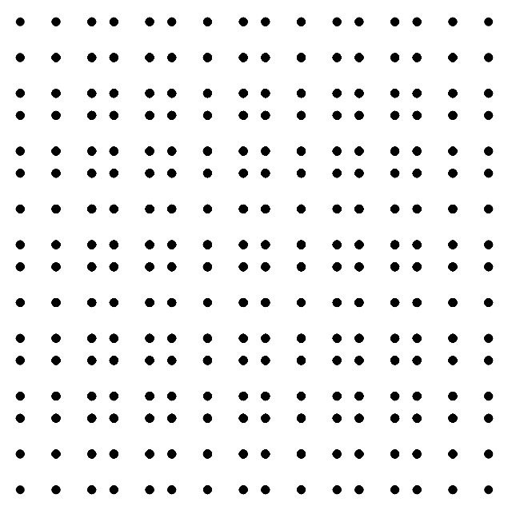

# HEGL Quasiperiodic Patterns

## About

This project is to be done as part for a seminar of the [Heidelberg HEGL group](https://hegl.mathi.uni-heidelberg.de/).

It is heavily inspired by a bachelor thesis about [Computing Quasiperiodic Patterns
in Python](http://pcwww.liv.ac.uk/~hemraj/thesis/BSc/2021_Daniel_Gouldsbrough_BSc_Thesis.pdf)

Key tasks include understanding the surrounding topic and rewriting & extending the given python
code into javascript using [p5js](https://p5js.org/)

## Timeline

✅ Done:

- rewrite
  - CutAndProject1D.py
  - CutAndProject2D.py

⏳ Todo:

- extend cut and project method to Penrose tilings
- ...

## Screenshots

cut-and-project1D.js

cut-and-project2D.js

## Acknowledgements

- [https://hegl.mathi.uni-heidelberg.de/](https://hegl.mathi.uni-heidelberg.de/)
- [http://pcwww.liv.ac.uk/~hemraj/thesis/BSc/2021_Daniel_Gouldsbrough_BSc_Thesis.pdf](http://pcwww.liv.ac.uk/~hemraj/thesis/BSc/2021_Daniel_Gouldsbrough_BSc_Thesis.pdf)
- [https://p5js.org/](https://p5js.org/)
