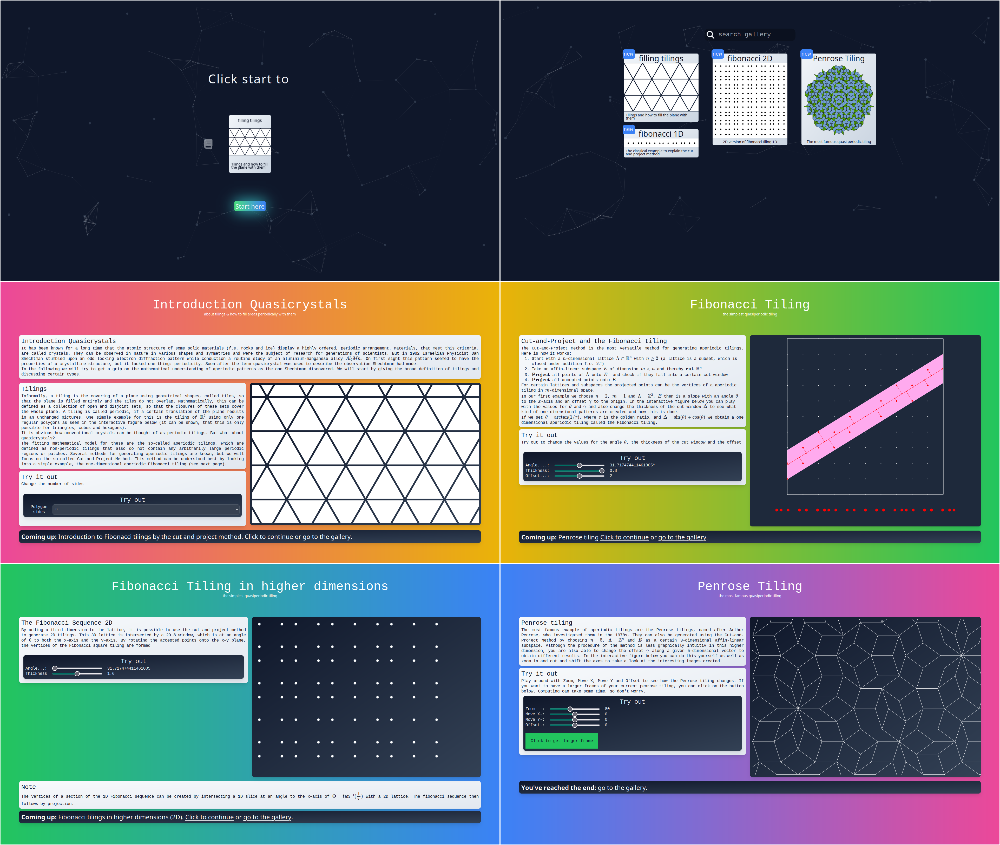

# HEGL Quasiperiodic Patterns

## About

This project is to be done as part for a seminar of the [Heidelberg HEGL group](https://hegl.mathi.uni-heidelberg.de/).

It is heavily inspired by a bachelor thesis about [Computing Quasiperiodic Patterns
in Python](http://pcwww.liv.ac.uk/~hemraj/thesis/BSc/2021_Daniel_Gouldsbrough_BSc_Thesis.pdf)

Key tasks include understanding the surrounding topic and rewriting & extending the given python
code into javascript using [p5js](https://p5js.org/)

The seminar group aims to create an interactive website to help anyone understand and visualize the concepts stated in aboves paper.

## Timeline

✅ Done:

- CutAndProject1D.py in Javascript p5js
- CutAndProject2D.py in Javascript p5js
- come up with interesting layout to put the examples in
- implement cut and project method for Penrose tilings
- make all examples interactive

⏳ Todo:

- make CutAndProject1D more visual
- optimize cut and project methods for Penrose tiling (e.g. with digital geometry)
- update introduction page (has logical errors)
- implement Wang tilings
- change the text to describe the examples better
- ...

## Screenshots

## Acknowledgements

- [https://hegl.mathi.uni-heidelberg.de/](https://hegl.mathi.uni-heidelberg.de/)
- [http://pcwww.liv.ac.uk/~hemraj/thesis/BSc/2021_Daniel_Gouldsbrough_BSc_Thesis.pdf](http://pcwww.liv.ac.uk/~hemraj/thesis/BSc/2021_Daniel_Gouldsbrough_BSc_Thesis.pdf)
- [https://p5js.org/](https://p5js.org/)
